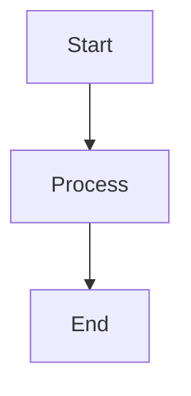

# AgentBuilder Documentation

Internal documentation site for the OzziOs AgentBuilder framework.

## Getting Started

### Installation

Dependencies are already installed. If you need to reinstall:

```bash
bun install
```

### Development

Start the development server:

```bash
# From the root of OzziOs
bun run docs:dev

# Or from docs-site directory
bun run start
```

The site will be available at `http://localhost:3001`.

### Building

Build the static site:

```bash
# From the root of OzziOs
bun run docs:build

# Or from docs-site directory
bun run build
```

### Serving the Built Site

Serve the production build locally:

```bash
# From the root of OzziOs
bun run docs:serve

# Or from docs-site directory
bun run serve
```

## Structure

```
docs-site/
├── docs/                          # Documentation markdown files
│   ├── intro.md                  # Welcome page
│   ├── architecture/             # Architecture documentation
│   │   ├── overview.md          # System architecture
│   │   ├── request-lifecycle.md # Request flow
│   │   ├── key-abstractions.md  # Core concepts
│   │   └── design-decisions.md  # Design rationale
│   ├── getting-started/         # Getting started guides (WIP)
│   └── reference/               # API reference (WIP)
├── src/
│   └── css/
│       └── custom.css           # Custom styling
├── static/
│   └── img/                     # Static images
├── docusaurus.config.ts         # Docusaurus configuration
├── sidebars.ts                  # Sidebar navigation
└── package.json                 # Dependencies

```

## Adding Documentation

### Create a New Page

1. Add a markdown file in the appropriate directory under `docs/`
2. Add frontmatter with sidebar position:

```markdown
---
sidebar_position: 1
---

# Page Title

Content here...
```

3. Update `sidebars.ts` if you want to customize the navigation

### Add Images

1. Place images in `static/img/`
2. Reference them in markdown:

```markdown

```

### Mermaid Diagrams

Docusaurus supports Mermaid diagrams out of the box:

````markdown

````

## Current Status

### Completed

- ✅ Docusaurus setup with TypeScript
- ✅ Architecture overview with system diagram
- ✅ Complete request lifecycle documentation
- ✅ Key abstractions (Agent, Workflow, Tool, Hooks, Context)
- ✅ Design decisions and rationale

### Coming Soon

- ⏳ Quick start guide
- ⏳ API reference documentation
- ⏳ Tool creation guide
- ⏳ Workflow customization guide
- ⏳ Examples and recipes

## Technology

- **Docusaurus 3.x** - Documentation framework
- **TypeScript** - Type-safe configuration
- **Mermaid** - Diagram rendering
- **Prism** - Code syntax highlighting

## Maintenance

When updating the AgentBuilder codebase, remember to update the documentation:

1. **New features** → Add to relevant architecture docs
2. **Breaking changes** → Update examples and API references
3. **New workflows** → Document in key abstractions
4. **New tools** → Add to tool documentation
