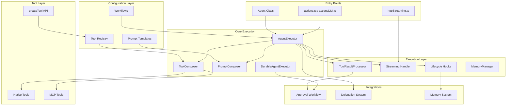

# Architecture Overview

AgentBuilder is a layered, composable framework for building AI agents. This page explains the system architecture and how the pieces fit together.

## System Purpose

AgentBuilder provides:

1. **A simple, VoltAgent-inspired API** for running AI agents
2. **Declarative workflow configurations** instead of manual setup
3. **A composable tool system** with approval workflows
4. **Lifecycle hooks** for extending behavior
5. **Multi-agent delegation** with supervisor orchestration
6. **Production features**: streaming, memory, error handling

## Architecture Layers

The system is organized into six layers, each with a clear responsibility:

### Layer 1: Entry Points

How requests enter the system:

- **`Agent` Class** (`Agent.ts`) - Main developer API, VoltAgent-inspired
- **Actions** (`actions.ts`, `actionsDM.ts`) - Convex action entry points for channels/DMs
- **HTTP Streaming** (`httpStreaming.ts`) - Server-Sent Events endpoint

**When to use each:**
- Use `Agent` class for programmatic agent creation
- Actions are called automatically by the frontend
- HTTP streaming powers real-time UI updates

### Layer 2: Core Execution

The execution engine that orchestrates everything:

- **`AgentExecutor`** (`harness/AgentExecutor.ts`) - Main execution loop
- **`DurableAgentExecutor`** (`harness/DurableAgentExecutor.ts`) - Durable workflow version with approval support
- **`PromptComposer`** (`harness/PromptComposer.ts`) - Builds system prompts from templates
- **`ToolComposer`** (`harness/ToolComposer.ts`) - Loads and filters tools

**Key responsibility:** Take an agent configuration, run the Claude API loop, handle tool calls, manage state.

### Layer 3: Configuration Layer

Declarative configuration instead of imperative setup:

- **`Workflows`** (`agentWorkflows.ts`) - Predefined configurations (supervisor, graphic_designer, channel, etc.)
- **`ToolRegistry`** (`registry.ts`) - Central tool catalog
- **`PromptTemplates`** (`prompts/`) - Reusable prompt components

**Why this matters:** You configure an agent by choosing a workflow, not by manually wiring up hooks/tools/prompts.

### Layer 4: Execution Layer

Runtime components that execute during agent runs:

- **`LifecycleHooks`** (`lifecycle/`) - Extension points (onStart, onToolStart, onEnd, etc.)
- **`StreamingHandler`** (`harness/StreamingHandler.ts`) - Real-time SSE streaming
- **`ToolResultProcessor`** (`harness/ToolResultProcessor.ts`) - Processes tool outputs
- **`MemoryManager`** (`harness/MemoryManager.ts`) - Conversation history and semantic search

**Key responsibility:** Execute the agent loop with proper hooks, streaming, and memory.

### Layer 5: Tool Layer

Tools that agents can execute:

- **`NativeTools`** (`tools/`) - 81+ built-in tools across 16 categories
- **`MCPTools`** (`mcp/`) - 17 MCP server integrations
- **`createTool`** (`createTool.ts`) - API for defining new tools

**Tool Categories:**
- Core: tasks, todos, notes, scheduling
- Content: blog, reports, knowledge
- Creative: design, media, assets
- Workspace: workspace, memory
- Special: delegation, onboarding, support, question

**All tools share:**
- Zod schema for input validation
- Approval configuration
- Unified execution context
- Standard result format

### Layer 6: Integrations

System-wide features:

- **`Approval Workflow`** (`approval/`) - Human-in-the-loop tool approval
- **`Delegation System`** (`delegationWorkflow.ts`) - Multi-agent orchestration
- **`Memory System`** (`memory/`) - Semantic search, workspace learnings

## Key Files Map

Here's where to find specific concepts:

### Entry Points
- `Agent.ts` - Main Agent class, factory functions
- `actions.ts` - Channel message responses
- `actionsDM.ts` - DM conversation responses
- `httpStreaming.ts` - SSE streaming endpoint

### Core Types
- `types.ts` - Core interfaces (Tool, ToolContext, AgentContext, etc.)
- `harness/types.ts` - Execution types (AgentRunResult, StreamingConfig, etc.)

### Execution
- `harness/AgentExecutor.ts` - Main execution loop (400+ lines)
- `harness/DurableAgentExecutor.ts` - Durable version with approval (900+ lines)
- `harness/PromptComposer.ts` - System prompt building
- `harness/ToolComposer.ts` - Tool loading logic

### Configuration
- `agentWorkflows.ts` - Workflow definitions and resolution
- `registry.ts` - Tool registry (register, lookup, toAnthropicTools)
- `prompts/index.ts` - Exported prompt templates
- `prompts/base.ts` - Core conversational prompts

### Tools
- `createTool.ts` - Tool creation API
- `nativeTools/` - All native tools (30+ tools)
- `mcp/` - MCP integrations (19 servers)
- `tools/` - New modular tool structure

### Lifecycle
- `lifecycle/createHooks.ts` - Hook factory functions
- `lifecycle/defaultHooks.ts` - Default Ozzi hooks
- `lifecycle/types.ts` - Hook interfaces

### Memory
- `memory/queries.ts` - Memory retrieval
- `memory/mutations.ts` - Memory persistence
- `harness/MemoryManager.ts` - Conversation history

## Comparison to VoltAgent

AgentBuilder draws inspiration from VoltAgent's design philosophy:

| Concept | VoltAgent | AgentBuilder |
|---------|-----------|--------------|
| **Agent API** | `new VoltAgent({ ... })` | `new Agent({ ... })` |
| **Configuration** | Declarative | Workflows (declarative bundles) |
| **Tools** | Tool definitions | `createTool()` + registry |
| **Hooks** | Lifecycle callbacks | Composable hooks with merging |
| **Streaming** | Built-in | Separate StreamingHandler |
| **Bail Pattern** | `bail()` to skip supervisor | `directReturn` flag in delegation |
| **Guardrails** | Input/output validation | Approval workflows + hooks |

**Key differences:**
- AgentBuilder uses **workflows** instead of manual configuration
- Tool approval is **integrated with Convex workflows** (durable, resumable)
- Hooks are **composable** (you can merge/chain multiple hooks)
- Streaming is **optional** and separate from core execution

## Design Principles

1. **Backend-first**: All logic in Convex, frontend is UI-only
2. **Composability**: Mix and match tools, hooks, workflows
3. **Type safety**: Full TypeScript + Zod validation
4. **Declarative**: Configure with workflows, not imperative code
5. **Production ready**: Approval, streaming, error handling, memory

---

**Next**: [Request Lifecycle](./request-lifecycle) to see how a request flows through these layers.
