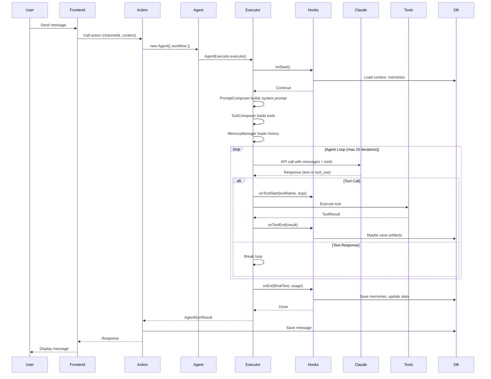

# Request Lifecycle

This page walks through a complete agent request from start to finish, showing how data flows through AgentBuilder's layers.

## Overview

When a user sends a message to an agent, here's the journey:



## Step-by-Step Walkthrough

### 1. User Sends Message

User types a message in a channel or DM conversation.

**Frontend:**
```typescript
// User types: "Create a task to review the Q4 budget"
const result = await sendMessage({
  channelId,
  content: "Create a task to review the Q4 budget",
});
```

### 2. Trigger Convex Action

The frontend calls a Convex action (channel or DM).

**File:** `convex/agentbuilder/actions.ts`

```typescript
export const respondToMessage = action({
  args: {
    channelId: v.id('channels'),
    messageId: v.id('messages'),
    // ... other args
  },
  handler: async (ctx, args) => {
    // Validate permissions, get workspace, etc.
    // ...
    
    // Create agent from workflow
    const agent = Agent.fromAgentFlags({
      ctx,
      workspaceId,
      agentId,
      agentFlags: {
        template: agentDoc.template,
        isDelegator: agentDoc.isDelegator,
        // ...
      },
    });
    
    // Generate response
    const result = await agent.generateText(userMessage, {
      channelId,
      messageId,
      userName,
    });
    
    // Save response to DB
    // ...
  },
});
```

### 3. Agent Class Created

The `Agent` class resolves the workflow and sets up defaults.

**File:** `convex/agentbuilder/Agent.ts`

```typescript
// Agent.fromAgentFlags() resolves workflow automatically
const workflow = resolveWorkflow({
  template: 'channel', // or 'supervisor', 'graphic_designer', etc.
  isDelegator: true,
});

// Agent stores workflow config
const agent = new Agent({
  ctx,
  workspaceId,
  agentId,
  workflow, // Contains: model, toolCategories, prompts, hooks
});
```

### 4. AgentExecutor Initialized

The `Agent.generateText()` method creates an `AgentExecutor`.

**File:** `convex/agentbuilder/harness/AgentExecutor.ts`

```typescript
const executor = new AgentExecutor({
  ctx,
  workspaceId,
  agentId,
  scope: { type: 'channel', channelId },
  trigger: { content, messageId, userName },
  hooks: getWorkflowHooks(workflow),
  toolCategoryConfig: getWorkflowToolCategories(workflow),
  memoryConfig: { enableSemanticSearch: true },
  loopStrategy: DEFAULT_CHANNEL_STRATEGY,
  // ...
});

return executor.execute();
```

### 5. Lifecycle Hook: onStart

Before execution begins, hooks can prepare context.

**File:** `convex/agentbuilder/lifecycle/defaultHooks.ts`

```typescript
// ozziOnStart hook
export async function ozziOnStart(args: OnStartArgs): Promise<void> {
  // Load user context
  // Load recent workspace learnings
  // Load conversation metadata
  // Prepare attachments
  
  console.log(`Agent ${args.agent.name} starting in channel ${args.channelId}`);
}
```

**What happens:**
- Loads workspace context
- Fetches semantic memories
- Prepares attachments
- Logs start event

### 6. PromptComposer Builds System Prompt

The system prompt is assembled from workflow templates.

**File:** `convex/agentbuilder/harness/PromptComposer.ts`

```typescript
const systemPrompt = buildAgentSystemPrompt({
  agent: agentDoc,
  workspace: workspaceDoc,
  prompts: workflow.prompts, // e.g., ['base', 'channel', 'tasks']
  toolCategories: workflow.toolCategories,
});
```

**Result:** A comprehensive system prompt with:
- Agent personality/role
- Channel context
- Tool usage instructions
- Current date/time
- Workspace learnings

### 7. ToolComposer Loads Tools

Tools are loaded based on workflow configuration.

**File:** `convex/agentbuilder/harness/ToolComposer.ts`

```typescript
// Get tools from registry
const tools = toolRegistry.toAnthropicTools({
  tasks: true,
  scheduling: true,
  notes: true,
  delegation: agentDoc.isDelegator,
  // ... other categories from workflow
});
```

**Result:** Array of Anthropic tool definitions matching the agent's capabilities.

### 8. MemoryManager Loads History

Conversation history is loaded for context.

**File:** `convex/agentbuilder/harness/MemoryManager.ts`

```typescript
// Load recent messages
const history = await loadConversationHistory({
  db: ctx.db,
  channelId,
  limit: 20,
});

// Convert to Claude message format
const messages = history.map(msg => ({
  role: msg.role,
  content: msg.content,
}));
```

### 9. Claude API Loop

The main agent loop calls Claude iteratively.

**File:** `convex/agentbuilder/harness/AgentExecutor.ts`

```typescript
let iteration = 0;
const maxIterations = 25;

while (iteration < maxIterations) {
  iteration++;
  
  // Call Claude API
  const response = await anthropic.messages.create({
    model: selectedModel,
    system: systemPrompt,
    messages: conversationMessages,
    tools: anthropicTools,
    max_tokens: 4096,
  });
  
  // Check stop reason
  if (response.stop_reason === 'end_turn') {
    // Agent finished - extract text
    finalText = extractTextContent(response.content);
    break;
  }
  
  if (response.stop_reason === 'tool_use') {
    // Agent wants to use tools - execute them
    await executeToolCalls(response.content);
    // Loop continues with tool results
  }
}
```

### 10. Tool Execution (if needed)

When Claude requests a tool call:

**File:** `convex/agentbuilder/harness/AgentExecutor.ts`

```typescript
async function executeToolCalls(content: ContentBlock[]) {
  for (const block of content) {
    if (block.type === 'tool_use') {
      const { name, input, id } = block;
      
      // Hook: onToolStart
      await hooks.onToolStart?.({
        toolName: name,
        toolArgs: input,
        iteration,
      });
      
      // Find and execute tool
      const tool = toolRegistry.get(name);
      const result = await tool.execute(input, toolContext);
      
      // Hook: onToolEnd
      const processedResult = await hooks.onToolEnd?.({
        toolName: name,
        toolArgs: input,
        result,
      });
      
      // Add result to conversation
      conversationMessages.push({
        role: 'user',
        content: [{
          type: 'tool_result',
          tool_use_id: id,
          content: JSON.stringify(result),
        }],
      });
    }
  }
}
```

### 11. Lifecycle Hook: onToolStart

Before tool execution:

```typescript
export async function ozziOnToolStart(args: OnToolStartArgs): Promise<void> {
  console.log(`Executing tool: ${args.toolName}`);
  
  // Could add approval checks here
  // Could validate arguments
  // Could log to analytics
}
```

### 12. Lifecycle Hook: onToolEnd

After tool execution:

```typescript
export async function ozziOnToolEnd(
  args: OnToolEndArgs
): Promise<OnToolEndResult> {
  // Process images from result
  const images = extractImagesFromResult(args.result);
  
  // Save task artifacts
  if (args.toolName === 'create_task') {
    await saveTaskArtifact(args.result);
  }
  
  // Truncate large results
  const truncated = truncateContent(args.result, MAX_TOOL_RESULT_LENGTH);
  
  return { modifiedResult: truncated };
}
```

### 13. Memory Persistence

During execution, the MemoryManager tracks important information:

```typescript
// After agent finishes
await memoryManager.saveConversation({
  messages: conversationMessages,
  toolCalls: executedTools,
  timestamp: Date.now(),
});
```

### 14. Lifecycle Hook: onEnd

After the agent loop completes:

```typescript
export async function ozziOnEnd(args: OnEndArgs): Promise<void> {
  const { finalText, usage, toolCalls } = args;
  
  // Log usage stats
  console.log(`Agent completed in ${usage.totalTokens} tokens`);
  
  // Save workspace learnings
  if (shouldSaveLearning(finalText)) {
    await saveWorkspaceLearning({
      content: finalText,
      workspaceId: args.workspaceId,
    });
  }
  
  // Update agent stats
  await updateAgentStats({
    agentId: args.agent._id,
    tokensUsed: usage.totalTokens,
    responseCount: 1,
  });
}
```

### 15. Response Delivered

The executor returns the final result:

**Return value:**
```typescript
const result: AgentRunResult = {
  text: "I've created a task to review the Q4 budget...",
  toolCalls: [
    {
      name: 'create_task',
      args: { title: 'Review Q4 budget', ... },
      result: { success: true, data: { taskId: '...' } },
    },
  ],
  usage: {
    inputTokens: 1234,
    outputTokens: 567,
    totalTokens: 1801,
  },
  steps: 2,
  stopReason: 'end_turn',
};
```

### 16. Action Saves Message

The action handler saves the agent's response:

```typescript
await ctx.runMutation(internal.channels.messages.create, {
  channelId,
  content: result.text,
  authorType: 'agent',
  authorId: agentId,
  toolCalls: result.toolCalls,
});
```

### 17. Frontend Displays Response

The frontend receives the response and updates the UI.

## Special Cases

### Streaming Responses

For real-time UI updates, use `StreamingHandler`:

**File:** `convex/agentbuilder/harness/StreamingHandler.ts`

```typescript
const streamingConfig = {
  streamId: 'stream-123',
  responseMessageId: message._id,
  onTextDelta: async (delta) => {
    await ctx.runMutation(internal.streaming.appendText, {
      messageId: message._id,
      delta,
    });
  },
  onToolCall: async (call) => {
    await ctx.runMutation(internal.streaming.addToolCall, {
      messageId: message._id,
      toolCall: call,
    });
  },
};
```

### Approval Workflows

When a tool requires approval, use `DurableAgentExecutor`:

**File:** `convex/agentbuilder/harness/DurableAgentExecutor.ts`

```typescript
// Agent execution pauses at tool approval
throw new ToolApprovalPendingError({
  toolName: 'send_email',
  toolArgs: { to: 'client@example.com', subject: '...' },
  approvalId: 'approval-123',
});

// Later, when approved, resume from saved state
const result = await executor.resumeFromApproval({
  approvalId: 'approval-123',
  approved: true,
});
```

### Multi-Agent Delegation

Supervisor agents can delegate to sub-agents:

**File:** `convex/agentbuilder/delegationWorkflow.ts`

```typescript
// Supervisor uses delegate_task tool
const result = await executeDelegation({
  delegations: [
    {
      agentId: 'seo-specialist',
      task: 'Analyze keyword opportunities',
      directReturn: false, // Supervisor will synthesize
    },
    {
      agentId: 'content-writer',
      task: 'Write blog outline',
      directReturn: false,
    },
  ],
});

// Each sub-agent runs through this same lifecycle
// Results are collected and returned to supervisor
```

## Performance Notes

- **Token caching**: System prompts are cached with Claude's prompt caching
- **Parallel tool execution**: Tools can run in parallel when safe
- **Streaming**: Reduces perceived latency for long responses
- **Memory limits**: Conversation history is truncated to fit token limits
- **Bail pattern**: `directReturn` skips supervisor synthesis, saves 30-80% tokens

---

**Next**: [Key Abstractions](./key-abstractions) to understand the core concepts in depth.
